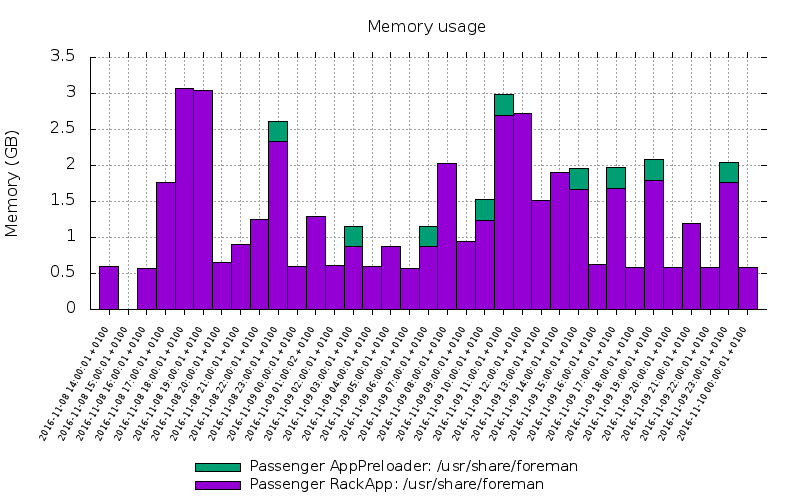

# Tools
Various tools and scripts to automate things

## chart-mem-usage

Convert data collected with
```bash
$ echo "0 * * * * root (date && ps aux --sort -rss | head -n20) >> output_file" > /etc/cron.d/mem_usage
```
to either csv `--format=csv` or gnuplot `--format=gnuplot`. The csv data are suitable for import to spreadsheet and further processing. The gnuplot can be piped to gnuplot to get the image:

```bash
$ chart-mem-usage --format gnuplot  --height 500 --width 800 --till '2016-11-10' --filter Passenger mem-usage|gnuplot|display
```



Full options:

```
$ chart-mem-usage -h
 Usage:
    chart-mem-usage [OPTIONS] DATA

  Preprocess data for chart of memory usage. Collect the data with
    $> echo "0 * * * * root (date && ps aux --sort -rss | head -n20) >> output_file" > /etc/cron.d/mem_usage

Parameters:
    DATA                          File with data collected from the cron job

Options:
    --filter FILTER               Regexp matching processes included in the chart
    --depth DEPTH                 Process name is split by spaces first N parts are used as process name (default: 3)
    --since SINCE                 Show logs after yyyy-mm-dd [HH:MM:SS]
    --till TILL                   Show logs before yyyy-mm-dd [HH:MM:SS]
    --cpu                         plot CPU usage instead of memory (default: false)
    --withpid                     Prepend process name with pid (default: false)
    --format FORMAT               Format of the output (One of 'csv, 'gnuplot') (default: "csv")
    --width WIDTH                 Width of the resulting image (with gnuplot only) (default: 1200)
    --height HEIGHT               Height of the resulting image (with gnuplot only) (default: 800)
    -h, --help                    print help
```
